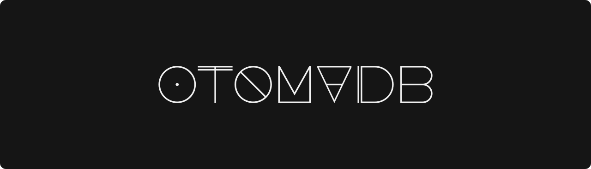

<h1 align="center">
  
</h1>

## 概要
 

  <strong>音MADのデータベースを作る。</strong>

### 目標

おおよそ以下の目標を持って目下開発中です。

1. [ニコニコ動画](https://www.nicovideo.jp)、[Youtube](https://www.youtube.com)、[bilibili](https://www.bilibili.com)、その他色々なプラットフォームに存在する音MADを統一的に登録してアクセス可能にする。
1. あなたの好みの傾向を分析し、オススメの音MADを推薦する。
1. 頑強なタグシステムを作る。

### 提案など

[ここ](https://github.com/otomadb/.github/discussions)で新機能の提案などを受け付けています。

## リポジトリ

### [otomadb/web](https://github.com/otomadb/web)

Webフロントエンド

### [otomadb/graphql-api](https://github.com/otomadb/graphql-api)

GraphQL API
